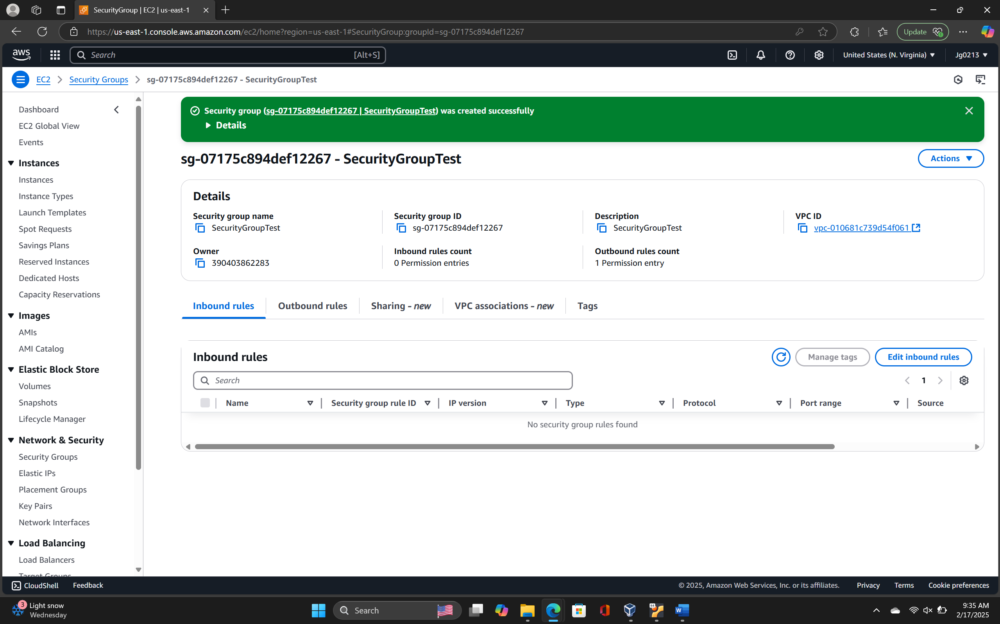
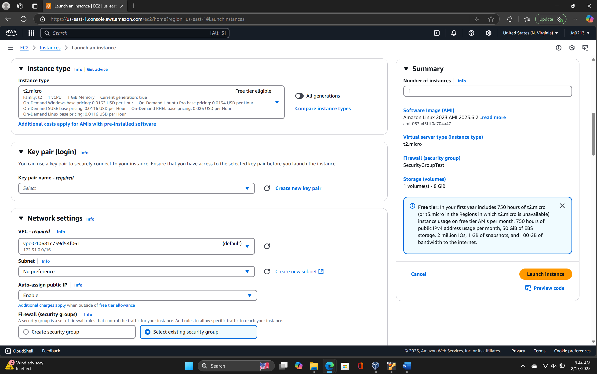
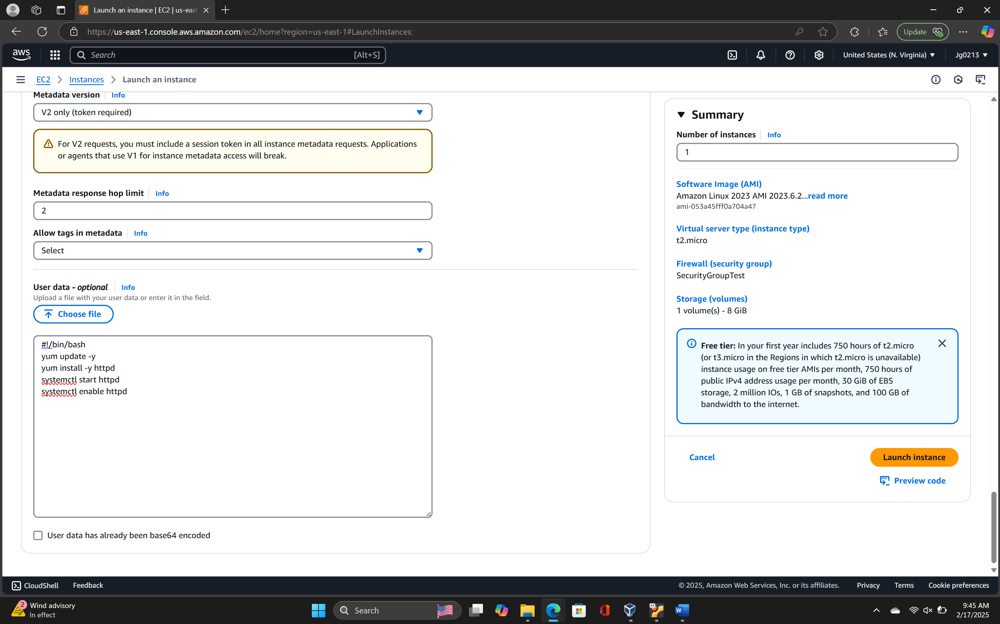
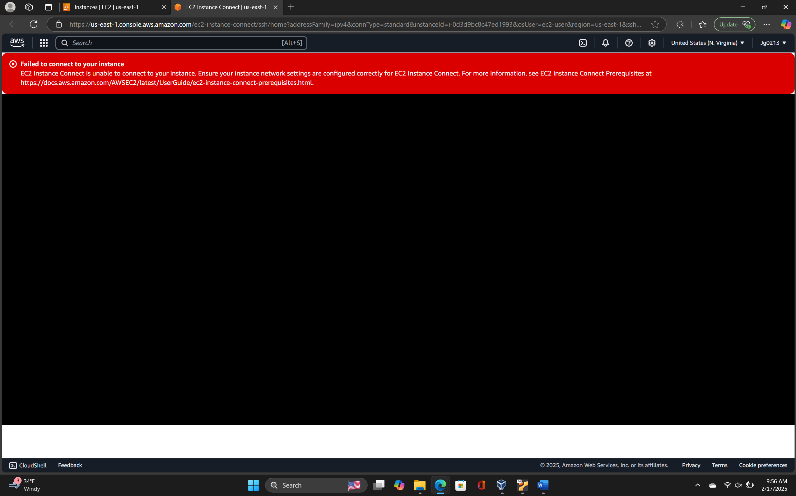
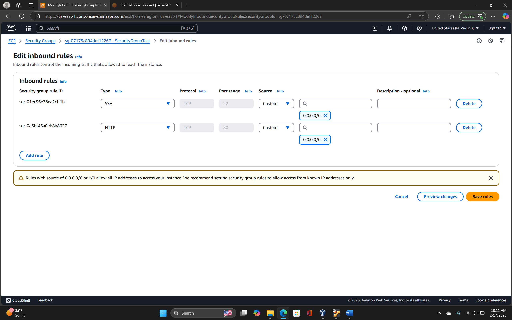
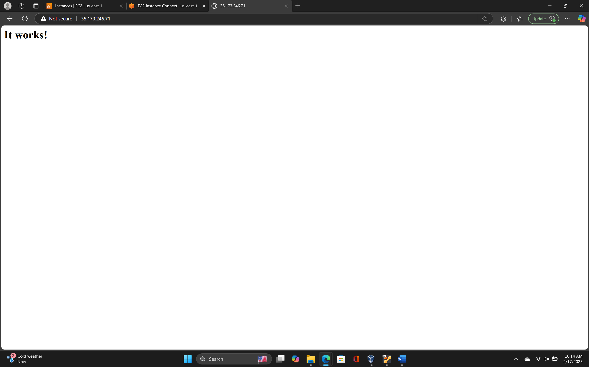

# 🔐 Security Groups – AWS EC2

This lab demonstrates how to create and apply a custom **AWS Security Group** to an EC2 instance, then validate its functionality by connecting to the instance and testing inbound traffic rules.

---

## 🛠️ Steps Performed

### 1. Create Security Group
- Logged into the **AWS Management Console** and navigated to the **EC2 Dashboard**.  
- Created a new **Security Group** inside the default VPC.  
- Initially, no inbound rules were configured (default deny).  

📸  

---

### 2. Launch EC2 Instance
- Launched a new **EC2 instance** and selected the created Security Group under **Network Settings**.  
- Successfully launched the instance.  

📸 
   

---

### 3. Initial Connection Attempt
- Attempted to connect via the EC2 console and by using the **public IPv4 address**.  
- **Result:** Connection failed (expected, since no inbound rules were set).  

📸  

---

### 4. Configure Inbound Rules
- Returned to the Security Group settings.  
- Added **two inbound rules**:  
  - **SSH (22)** from a specific IP (my own).  
  - **HTTP (80)** from a specific IP.  
- Saved the changes.  

📸 

---

### 5. Validate Access
- Re-tested connection:  
  - Successfully connected via **SSH** to the EC2 instance.  
  - Navigated to the instance’s public IPv4 in a browser → received the **Apache “It Works” page**.  
  
📸  

---

## 📊 Key Learnings
- **Security Groups are stateful** firewalls at the instance level:  
  - If inbound traffic is allowed, the corresponding outbound response is automatically permitted.  
- Without rules, **all inbound traffic is denied by default**.  
- Testing and troubleshooting confirmed the rule changes worked as expected.  
- Properly scoped rules (limiting to specific IPs) are critical for security.  

---
