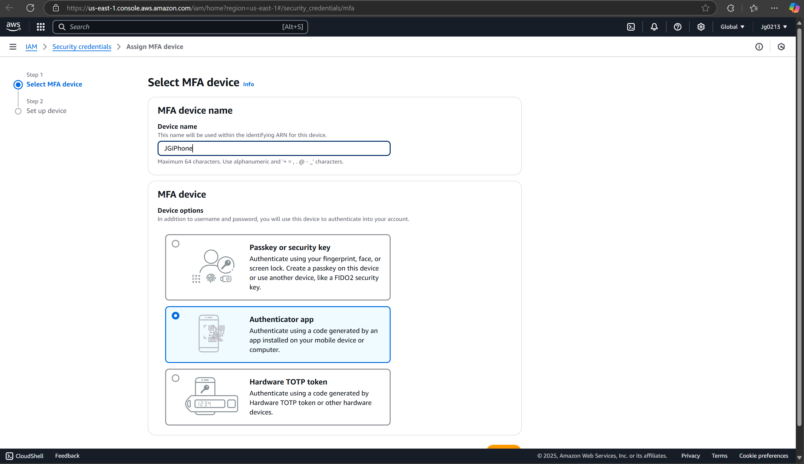
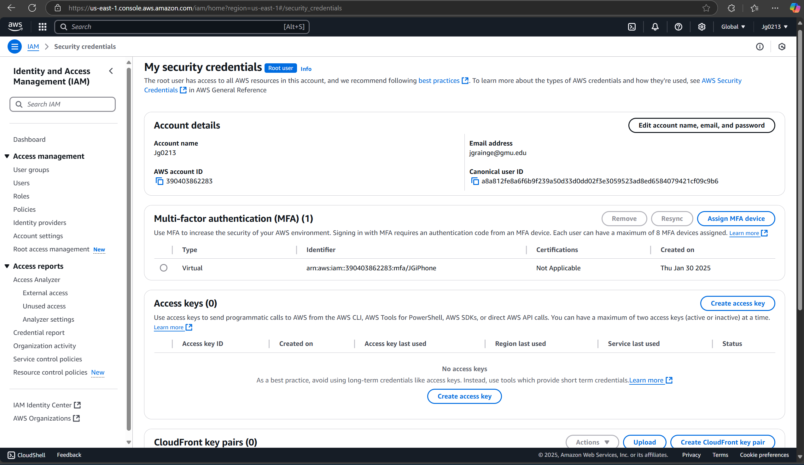

# Multi-Factor Authentication (MFA)

- Logged into AWS IAM dashboard.
- Enabled MFA using **Duo Mobile App** (Authenticator method).
- Successfully tested with generated codes.

**Result:** Root account now requires MFA for login.

## Evidence

