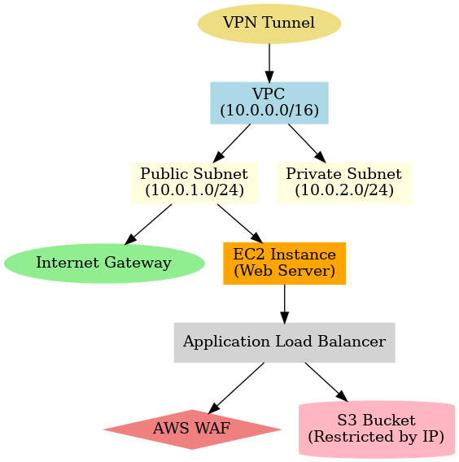

# AWS-Network-Services-Lab

This repository documents a series of hands-on AWS networking and security labs demonstrating how to design, secure, and monitor cloud infrastructure. The goal is to show practical network engineering and cloud security skills relevant to enterprise environments.

## 🚀 Lab Objectives
- Design and deploy a **custom VPC** with subnets, route tables, and internet gateway
- Configure **EC2 instances** with Security Groups and Network ACLs
- Implement a **VPN tunnel** for secure connectivity
- Deploy an **AWS Web Application Firewall (WAF)** with a Load Balancer
- Restrict **S3 bucket access** to specific IP addresses
- Harden the root account with **Multi-Factor Authentication (MFA)**
- Monitor activity using **CloudWatch**

## 🗂️ Repository Structure
- **01-VPC-Setup/** → VPC creation, subnets, routing, diagrams
- **02-EC2-and-Security/** → EC2 instance setup, firewall rules (SGs + NACLs)
- **03-VPN-Access/** → VPN tunnel configuration and troubleshooting notes
- **04-WAF-and-Load-Balancing/** → WAF rules, load balancer config, CloudWatch logs
- **05-S3-Access-Control/** → S3 bucket policy restricting access by IP
- **06-MFA-Account-Hardening/** → MFA enabled on AWS account
- **/diagrams/** → Visual network diagrams for architecture, VPN, and WAF flow

## 🛠️ Skills Demonstrated
- **Networking:** TCP/IP, routing, firewalls, VPNs, ACLs
- **Cloud Infrastructure:** AWS VPC, EC2, IAM, Security Groups, Subnets
- **Security Controls:** AWS WAF, MFA, CloudWatch monitoring, IP-based restrictions
- **Documentation:** Professional reporting, troubleshooting notes, architecture diagrams

## 📊 Architecture Overview

---

👤 **Author**: Jack Grainger  
📍 Alexandria, VA  
📧 jackcgrainger@gmail.com | [GitHub Portfolio](https://github.com/jackgrainger) 
