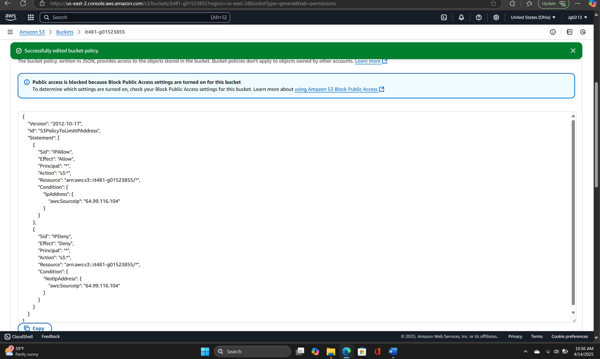
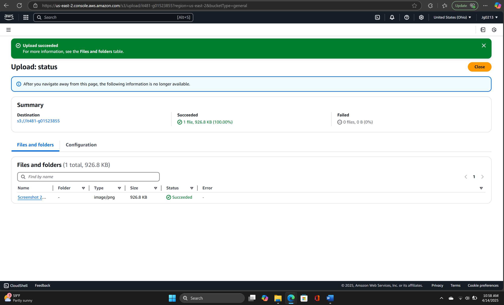
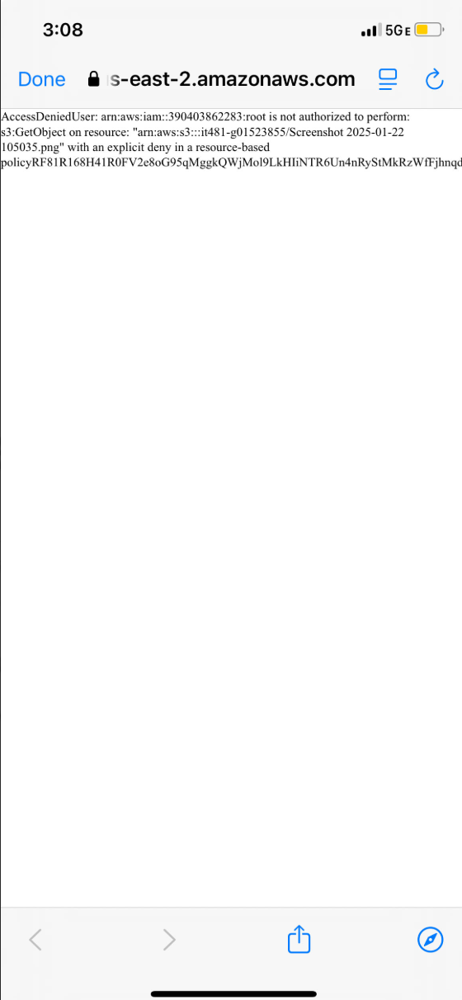

# S3 Bucket Policy

- Edited bucket policy to restrict access to a **specific IP address**.
- Verified access from whitelisted IP → ✅ Success.
- Verified access from different device → ❌ “Access Denied.”

**Takeaway:** Fine-grained bucket policies can enforce network-level security.

## Evidence

