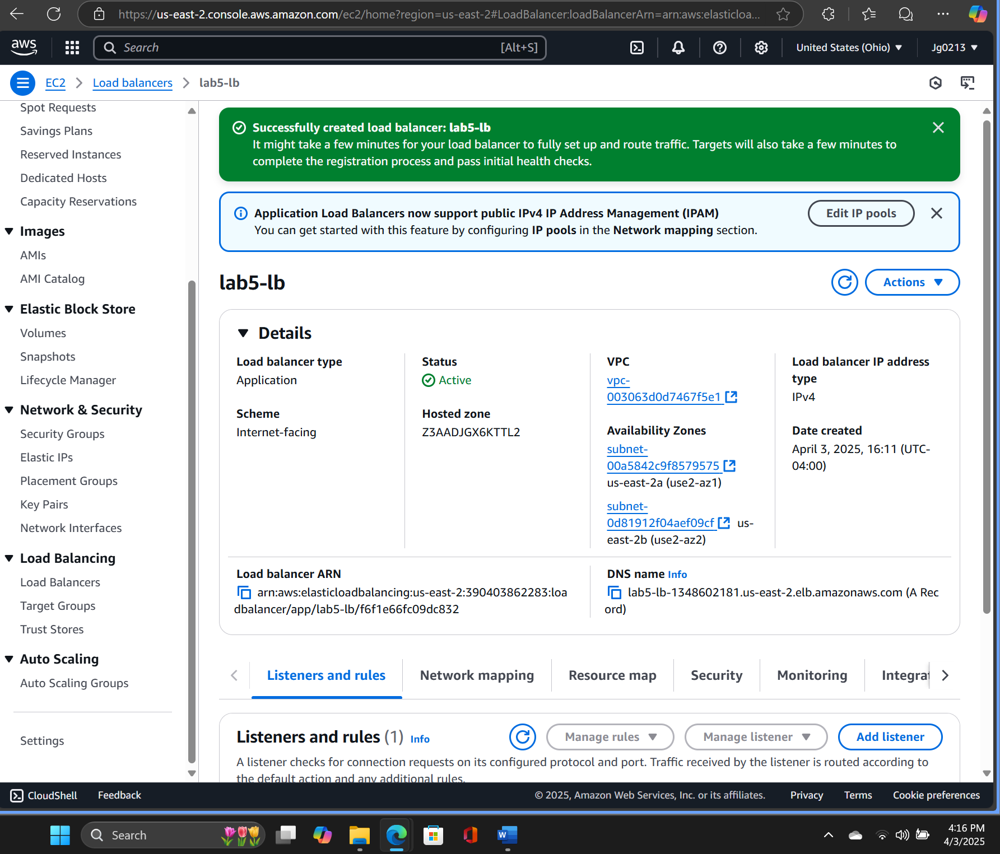

# AWS Web Application Firewall (WAF)

- Created a WAF ACL with rules to block a test IP address.
- Attached WAF to an Application Load Balancer.
- Verified traffic blocking by accessing the load balancer’s DNS name.

**Result:** Requests from the blocked IP received an error page.
## Evidence

